# Hi, I'm Kachi 👋

**Data Scientist | PhD in Mathematics | MLOps · LLMs · Quasi-Monte Carlo**

I build end-to-end data pipelines, ML systems, and research-grade numerical algorithms. My work sits at the intersection of applied mathematics and production machine learning.

- 🔭 Currently researching **Quasi-Monte Carlo methods** and their applications in ML
- 🤖 Building **RAG systems** and LLM-powered applications
- ☁️ Experienced with **GCP** (BigQuery, GCS, Terraform, Dataproc)
- 📝 Writing about data science on [Medium](https://medium.com/@kachiann)
- 📄 Academic work on [Google Scholar](https://scholar.google.com/citations?user=Qe94rEoAAAAJ&hl=en) · [ORCID](https://orcid.org/0000-0003-1081-4481)

---

## 🛠 Tech Stack

**Languages**

**ML & Data**

**MLOps & Infrastructure**

**NLP**

---

## 📌 Featured Projects

| Project | Description | Stack |
|---|---|---|
| [Citi Bike Analytics Pipeline](https://github.com/kachiann/Citi-Bike-Analytics-Pipeline) | Batch data engineering pipeline with partitioned DWH and Streamlit dashboard | GCP · Terraform · BigQuery · Python |
| [Nursing Mothers RAG Chatbot](https://github.com/kachiann/nursing-mothers-rag-chatbot) | RAG-based chatbot answering nursing & infant care questions | Python · LangChain · Vector DB |
| [MLOps Bike Demand](https://github.com/kachiann/project-mlops) | Full MLOps pipeline for bike-sharing demand forecasting | MLflow · Python · Docker |
| [Hotel Booking Cancellations](https://github.com/kachiann/Hotel_Booking_Cancellations) | ML model to predict cancellations and optimize revenue strategy | Python · Scikit-Learn |

---

---

## 🤝 Connect

> Open to **collaborations** on ML research, data engineering, or LLM applications. DM on LinkedIn!
